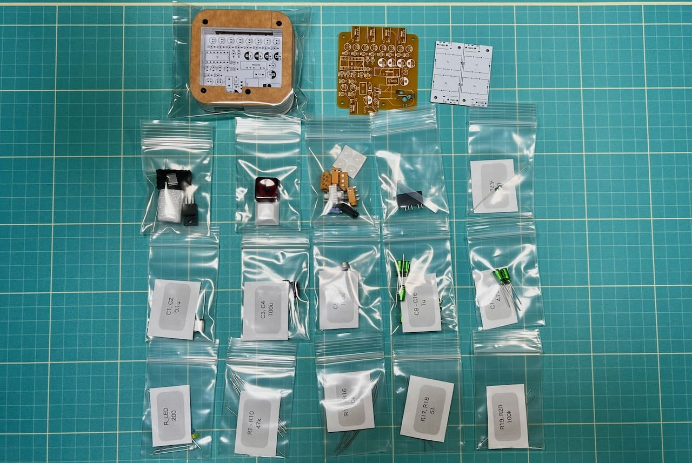

# 4入力ステレオミキサー ビルドガイド
- [ご注意](#ご注意)
- [部品リスト](#部品リスト)
- [組み立て](#組み立て)
- [おまけ](#おまけ)

## ご注意
- Type-A to Type-Cケーブルでのみ給電できます。
- ボリューム調整機能はありません。
- マイクには対応していません。
- 入力端子同士の間隔は1.2cmです。

## 部品リスト
  
|Ref|部品名|数|
|-|-|-|
||メインボード||
||アクリルプレート||
||0.01mm両面テープ||
||5mmM2ねじ|8|
||3x8mmスペーサー|4|
|U1|丸ピンICソケット 14P|1|
||オペアンプ LME49740NA|1|
|MAU108|レギュレーター MAU108|1|
|REG1|レギュレーター NJM7805FA|1|
|USB1|Type-Cコネクタ電源供給用|1|
|TRRS1-5|MJ-4PP-9|5|
|R1-10|47kΩ|10|
|R11-16|10kΩ|6|
|R17,18|51Ω|2|
|R19,20|100kΩ|2|
|R_LED|200Ω|1|
|C1,2|0.1uF フィルムコンデンサー|2|
|C3,4|100uF 電源用電解コンデンサー|2|
|C5-8|100uF OS-CON|4|
|C9-16|1uF オーディオ用無極性コンデンサー|8|
|C17,18|4.7uF オーディオ用無極性コンデンサー|2|
|D1|1N4007|1|
|L1|4.7uH|1|
|LED1|3mmLED 3V 20mA|1|
||キースイッチ|1|
||キーキャップ|1|
||スイッチソケット|1|
||ゴム足|4|

### 工具（必要に応じて準備してください）
|工具名||
|-|-|
|はんだ付け用工具一式||
|精密ドライバー||
|ニッパー|抵抗等の足を切ります。|
|ラジオペンチ|レギュレーターの足を曲げます。ニッパーでも可能です。|
|アクリサンデー ポリケアF70|指紋を拭いたりホコリを付きにくくできます。|
|アクリサンデー 研磨剤|側面を磨いてツルツルにしたり、細かい傷を消すことができます。|
|アクリル接着剤|両面テープの代わりに使うと強固に接着できます。|

## 組み立て
電子部品は番号通りに部品をはんだ付けするだけなのでビルドガイドを見なくても制作可能です。高さが低い順番にはんだ付けする様子を写真で紹介しています。  

  
  
  
Type-Cコネクタはマスキングテープなどで固定するとはんだ付けしやすいです。
  
  
  
OS-CONには極性があります。
  
レギュレーターの足をラジオペンチ等で曲げます。
  
  
コイルや抵抗は写真のように足を曲げて縦に取り付けます。

  
  
  
  
  
  
フィルムコンデンサーには極性がありません。
  
電源用電解コンデンサーには極性があります。
  
オーディオ用コンデンサーには極性がありません。
  
  
すべてのパーツをはんだ付けしたらオペアンプを差し込んで動作を確認しましょう。

アクリルケースを組み立てます。スペーサー4つをネジで取り付けます。
  

アクリルプレートから保護フィルムを剥がしのせていきます。順番は写真を参考にしてください。
  
  
  
  
  
ネジは締めきらず、微調整できるようにしておくと側面を綺麗に揃えやすいです。

裏返して片面を剥がした両面テープを貼ります。皮脂が付いていると剥がれやすくなるので気をつけてください。
  
両面テープをはがし、側面のカーブを合わせて貼り付けます。
  
残りのプレートも同じように貼り付けます。
  
  
  
好みのキーキャップとスイッチを差し込んで、ゴム足を付けたら完成です。

## おまけ
### LEDを光らせる
キースイッチによってはLEDを取り付ける穴が開いていないことがあります。また、LEDをはんだ付けするとキースイッチを外せなくなります。
  
裏面のネジを外してプレートを取り除き、キースイッチの上からLEDを差します。写真と同じように、長い方の足が四角のパッドから出るようにしてください。
  
はんだ付けして足を切り、プレートを戻します。
  
USBを繋いでスイッチを押すとLEDが発光します。

### ノイズ対策
ジリジリしたノイズが乗っている場合、グラウンドループアイソレーターを使うことで解決することがあります。
おまけの基板に別売りのTRRSジャック（MJ-4PP-9）とトランス（AT129）をはんだ付けすると作ることができます。
検索すると市販のものもたくさん出てくるので好きなものを使ってください。

### 自分で発注する
#### PCB
- kicadファイル
- Elecrow向けガーバー
#### アクリル
- kicadファイル
- Elecrow向けzipファイル
## 販売ページ
遊舎工房フリマで販売予定です。
- [BOOTH](https://tarohayashi.booth.pm/items/4144494)  
